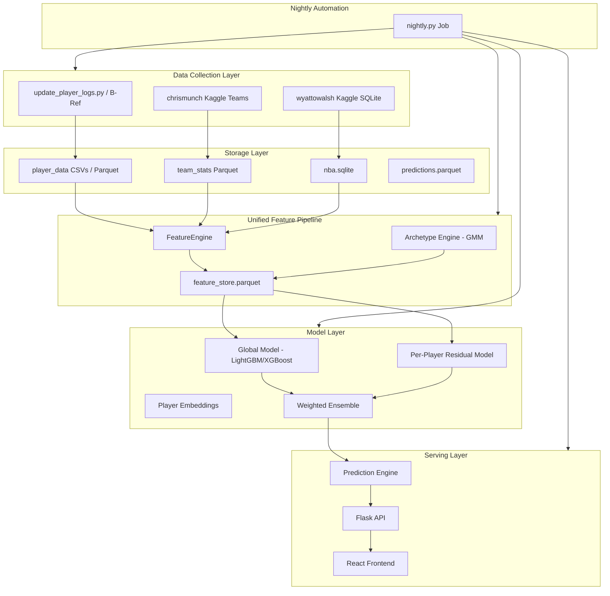

# NBA Prediction System Rebuild

## The Problem

The current system has several fundamental issues that cap accuracy regardless of how much data you throw at it:

1. **Train-serve skew** -- Training uses `feature_engineering.py` to build features, but inference in `prediction_engine.py` rebuilds them with completely different logic (different opponent encoding, different trend calculations, different career stats, heuristic archetypes). The model is literally seeing different numbers at inference than it learned from.
2. **Data leakage** -- `AVG_{stat}_VS_OPP` is computed across full history (includes future games), `WIN` column leaks game outcome, archetype rolling windows include the current game.
3. **Weak validation** -- Single 80/20 chronological split with early stopping and model selection on the same held-out set = optimistic bias.
4. **Per-player models with no fallback** -- A player with 50 career games gets their own LightGBM model. That is nowhere near enough data for gradient boosting to generalize. Rookies and low-minute players get nothing.
5. **Team scores are a hack** -- Summing individual player point predictions with a fudge factor is not a real game model.

---

## Architecture: What We're Building



---

## Phase 1: Unified Feature Pipeline (Kill Train-Serve Skew)

**The single most impactful change.** One class produces features for both training and inference. No separate code paths.

### Key features to add:

- **Defense vs Position (DvP)**: opponent's stats allowed to the player's position -- this is one of the highest-signal features for player props.
- **Minutes projection**: rolling average of minutes is the #1 predictor of counting stats.
- **Teammate availability**: which other key players are playing/injured affects usage redistribution.
- **Pace-adjusted rolling stats**: stats per 100 possessions rather than raw.
- **Play-by-play Clutch Flow**: Deriving critical momentum metrics using the SQLite play-by-play breakdown.

### Storage format change: CSV to Parquet

- Parquet is 5-10x faster for read/write, supports column types natively, and compresses well.
- Current CSV structure will be smoothly migrated to `.parquet`.

---

## Phase 2: Data-Driven Player Archetypes (Replace Rule-Based)

**New approach:** Gaussian Mixture Model (GMM) clustering on PCA-reduced per-100-possession stats.

### Why GMM over rule-based:
- Adapts to how the league actually plays (positionless basketball)
- No arbitrary thresholds to maintain
- Soft clustering captures that a player can be 60% "primary creator" and 40% "off-ball scorer"

---

## Phase 3: Hybrid Model Architecture (The Core ML Change)

**New approach:** Two-tier hybrid architecture.

### Tier 1: Global Model (trained on ALL players)
A single model per target stat, trained on the entire league's historical data using **LightGBM**.

### Tier 2: Per-Player Residual Model (only for players with 150+ games)
Trained on the **residuals** (errors) of the global model for that specific player. Falls back to global model only for players with insufficient history.

### Final prediction:
```
prediction = global_model(features) + residual_model(features)  [if enough data]
prediction = global_model(features)                              [otherwise]
```

---

## Phase 4: Data Collection Improvements (COMPLETED)

We have permanently removed reliance on `nba_api` due to connection volatility and replaced the entire subsystem with the following native flows:
- **Player Stats:** Custom Basketball-Reference Scraper iterating directly into local records (`update_player_logs.py`).
- **Team Stats:** `chrismunch/nba-game-team-statistics` (via Kaggle API).
- **Advanced Features:** `wyattowalsh/basketball` 2.3GB `nba.sqlite` tracking officials, line_scores, and sub-minute play-by-play. (via Kaggle API).

---

## Phase 5: Autonomous Nightly Pipeline (COMPLETED)

**Goal:** Every night after games finish, the system automatically runs `backend/pipeline/nightly.py`, which:
1. Downloads `teams_boxscores.csv` (Kaggle)
2. Downloads `nba.sqlite` (Kaggle)
3. Fetches / Appends player Box Scores (BRef web scraper)
4. Rebuilds aggregate stats & dependencies.

### What to delete:
- The `backend/delete_later/` directory has been completely wiped.
- `backend/prediction_storage.py` and other deprecated handlers are purged.

---

## Phase 6: API and Frontend Cleanup

### Flask API:
- Fix `requirements.txt` to include Flask, flask-cors, pytz
- Simplify endpoints to use the new unified predictor

### React Frontend:
- Replace hardcoded `localhost:5001` with env-driven API URL
- Actually use React Query (TanStack Query) instead of raw fetch+useState

---

## Files to Keep

| File                                             | Reason                                    |
| ------------------------------------------------ | ----------------------------------------- |
| `backend/data_collection/update_player_logs.py` | Reliable Python Scraper                   |
| `backend/data_collection/build_team_stats...`   | Team stats collection works               |
| `backend/pipeline/nightly.py`                   | Core orchestrated runtime                 |
| `backend/web/app.py`                            | Flask API shell (needs endpoint rewrite)  |
| `lovable/`                                       | React UI works, just needs API fixes      |
