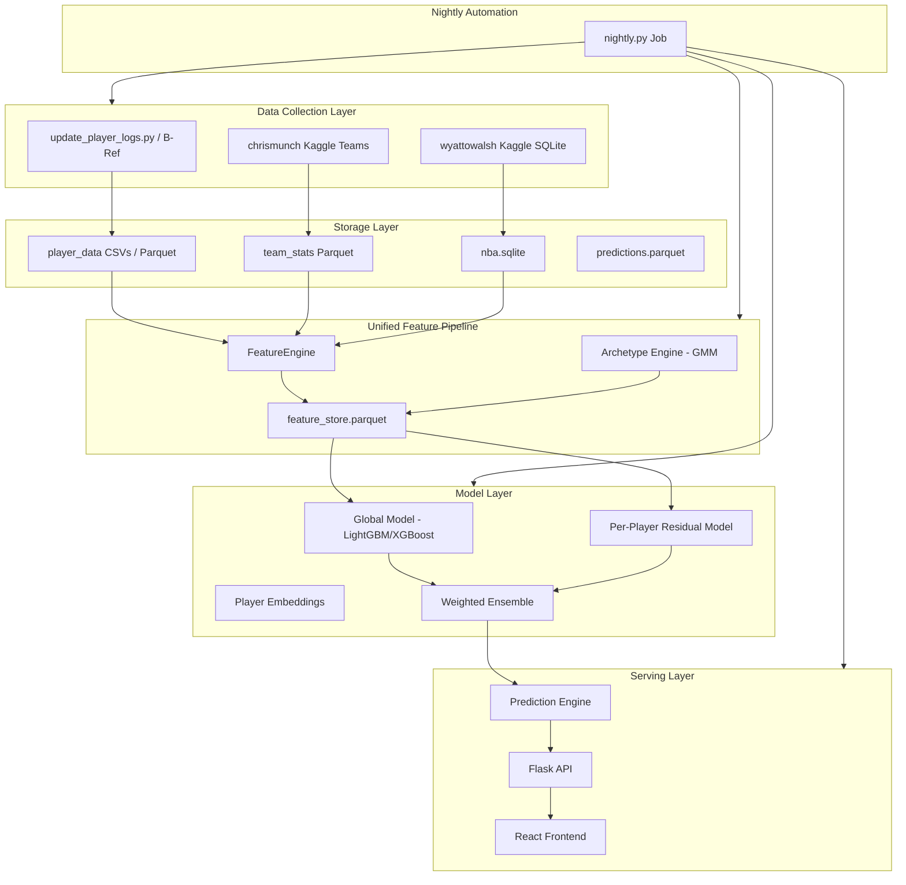

# NBA Prediction System Rebuild

## The Problem

The current system has several fundamental issues that cap accuracy regardless of how much data you throw at it:

1. **Train-serve skew** -- Training uses `feature_engineering.py` to build features, but inference in `prediction_engine.py` rebuilds them with completely different logic (different opponent encoding, different trend calculations, different career stats, heuristic archetypes). The model is literally seeing different numbers at inference than it learned from.
2. **Data leakage** -- `AVG_{stat}_VS_OPP` is computed across full history (includes future games), `WIN` column leaks game outcome, archetype rolling windows include the current game.
3. **Weak validation** -- Single 80/20 chronological split with early stopping and model selection on the same held-out set = optimistic bias.
4. **Per-player models with no fallback** -- A player with 50 career games gets their own LightGBM model. That is nowhere near enough data for gradient boosting to generalize. Rookies and low-minute players get nothing.
5. **Team scores are a hack** -- Summing individual player point predictions with a fudge factor is not a real game model.

---

## Architecture: What We're Building



---

## Phase 1: Unified Feature Pipeline (Kill Train-Serve Skew)

**The single most impactful change.** One class produces features for both training and inference. No separate code paths.

### Key features to add:

- **Defense vs Position (DvP)**: opponent's stats allowed to the player's position -- this is one of the highest-signal features for player props.
- **Minutes projection**: rolling average of minutes is the #1 predictor of counting stats.
- **Teammate availability**: which other key players are playing/injured affects usage redistribution.
- **Pace-adjusted rolling stats**: stats per 100 possessions rather than raw.
- **Play-by-play Clutch Flow**: Deriving critical momentum metrics using the SQLite play-by-play breakdown.

### Storage format change: CSV to Parquet

- Parquet is 5-10x faster for read/write, supports column types natively, and compresses well.
- Current CSV structure will be smoothly migrated to `.parquet`.

---

## Phase 2: Data-Driven Player Archetypes (Replace Rule-Based)

**New approach:** Gaussian Mixture Model (GMM) clustering on PCA-reduced per-100-possession stats.

### Why GMM over rule-based:
- Adapts to how the league actually plays (positionless basketball)
- No arbitrary thresholds to maintain
- Soft clustering captures that a player can be 60% "primary creator" and 40% "off-ball scorer"

---

## Phase 3: Hybrid Model Architecture (The Core ML Change)

**New approach:** Two-tier hybrid architecture.

### Tier 1: Global Model (trained on ALL players)
A single model per target stat, trained on the entire league's historical data using **LightGBM**.

### Tier 2: Per-Player Residual Model (only for players with 150+ games)
Trained on the **residuals** (errors) of the global model for that specific player. Falls back to global model only for players with insufficient history.

### Final prediction:
```
prediction = global_model(features) + residual_model(features)  [if enough data]
prediction = global_model(features)                              [otherwise]
```

---

## Phase 4: Data Collection Improvements (COMPLETED)

We have permanently removed reliance on `nba_api` due to connection volatility and replaced the entire subsystem with the following native flows:
- **Player Stats:** Custom Basketball-Reference Scraper iterating directly into local records (`update_player_logs.py`).
- **Team Stats:** `chrismunch/nba-game-team-statistics` (via Kaggle API).
- **Advanced Features:** `wyattowalsh/basketball` 2.3GB `nba.sqlite` tracking officials, line_scores, and sub-minute play-by-play. (via Kaggle API).

---

## Phase 5: Autonomous Nightly Pipeline (COMPLETED)

**Goal:** Every night after games finish, the system automatically runs `backend/pipeline/nightly.py`, which:
1. Downloads `teams_boxscores.csv` (Kaggle)
2. Downloads `nba.sqlite` (Kaggle)
3. Fetches / Appends player Box Scores (BRef web scraper)
4. Rebuilds aggregate stats & dependencies.

### What to delete:
- The `backend/delete_later/` directory has been completely wiped.
- `backend/prediction_storage.py` and other deprecated handlers are purged.

---

## Phase 6: API and Frontend Cleanup

### Flask API:
- Fix `requirements.txt` to include Flask, flask-cors, pytz
- Simplify endpoints to use the new unified predictor

### React Frontend:
- Replace hardcoded `localhost:5001` with env-driven API URL
- Actually use React Query (TanStack Query) instead of raw fetch+useState

---

## Files to Keep

| File                                             | Reason                                    |
| ------------------------------------------------ | ----------------------------------------- |
| `backend/data_collection/update_player_logs.py` | Reliable Python Scraper                   |
| `backend/data_collection/build_team_stats...`   | Team stats collection works               |
| `backend/pipeline/nightly.py`                   | Core orchestrated runtime                 |
| `backend/web/app.py`                            | Flask API shell (needs endpoint rewrite)  |
| `lovable/`                                       | React UI works, just needs API fixes      |

---

# Remediation Backlog (added after full code audit)

> **Reality check:** Phases 1–5 are marked `completed`, but a full read of the code shows the *goals* of Phases 1–3 are **not** actually met. The unified `FeatureEngine` still has train-serve skew, season-aggregate leakage, and an unvalidated hybrid model. The phases below are the concrete, atomic work to close the gap between "code exists" and "the stated problem is solved." Tasks are ordered by dependency and severity — do them top to bottom within each phase. Each task is intended to be a single, self-contained PR.

## Phase 7 — Kill Train-Serve Skew & Leakage (the real Phase 1–3)

- [x] **7.1 — Unify the two training scripts onto one feature set.** ✅ Done. Added `split_features_targets()` (+ centralized `ID_LIKE`) as the single source of truth in `feature_engine.py`; both `train_global._feature_target_split` and `train_hybrid._feature_target_split` now delegate to it, so `feature_columns.json` is identical regardless of which trainer runs. `save_feature_columns()` now warns on any divergent overwrite. Proven by `backend/tests/test_feature_selection_alignment.py` (RED before the fix: train_global kept 11 leaky/unmanaged raw columns; GREEN after). *Note for 7.2: `_clean_output_columns` still self-contradicts on `TS_PCT`/`USG_PCT` (listed in `managed_exact` so kept, despite the trailing comment saying they're leaky) — left untouched, belongs to 7.2.*
- [x] **7.2 — Remove leaky raw columns from the global trainer.** ✅ Done. After 7.1 the global trainer already routes through `_clean_output_columns`, so features are a subset of the managed whitelist by construction (`FGA`/`FTA`/`REB`/`PLUS_MINUS`/`*_PER100` were already dropped). This task fixed the remaining self-contradiction: `_clean_output_columns` listed raw `TS_PCT`/`USG_PCT` in `managed_exact` (kept) despite the trailing comment saying they're leaky — removed them so the explicit exclusion fires; rolling `TS_PCT_L*`/`USG_PCT_L*` are retained. Proven by `backend/tests/test_whitelist_leakage.py` (RED: `TS_PCT`/`USG_PCT` survived; GREEN after). **Requires a model retrain** to regenerate artifacts + `feature_columns.json` without these columns. *Severity: critical.*
- [ ] **7.3 — Eliminate full-season team-rating leakage.** `feature_engine.py:251-286` merges `TEAM_PACE`/`TEAM_OFF_RATING`/`TEAM_DEF_RATING`/`OPP_*` on `(team, SEASON)` from full-season aggregates, so every mid-season row sees end-of-season (future) ratings. Replace with as-of/prior-games-only team ratings (rolling or shifted-to-date), matching the `KG_PREV_*` prior-game pattern already used elsewhere. *Severity: critical.*
- [ ] **7.4 — Make `position_encoded` a stable, shared mapping.** `feature_engine.py:231` uses `pd.Categorical(...).codes` recomputed per-frame, so the same position maps to different integers across players. Replace with a fixed position→int dictionary defined once and reused at train and inference. *Severity: medium (skew).*
- [ ] **7.5 — Make archetype (`ARCH_PROB_*`) columns deterministically present.** `feature_engine.py:535-539` and `:655-659` swallow archetype failures, so columns appear at inference but not training (or vice-versa); `train_hybrid.py:47` even branches on their presence. Fail loudly if the archetype engine can't load, and guarantee the same `ARCH_PROB_*` schema in both paths (fill with the training prior, not 0.0). *Severity: high (skew).*
- [ ] **7.6 — Add a train-serve skew guard at inference.** `predictor.py:89-98` does `reindex(...).fillna(0.0)`, silently turning any uncomputed managed feature into 0.0 (and only `logger.debug`). Add an assertion/structured-warning when a non-trivial fraction of managed columns (esp. `ARCH_PROB_*`, `OPP_PRIOR_AVG_*`, `KG_PREV_*`, `DVP_*`) are missing for a player, so skew is observable instead of silent. *Severity: high.*
- [ ] **7.7 — Fix the home/away rolling cross-contamination.** `feature_engine.py:187-219` `merge_asof` joins the latest prior HOME-rolled and AWAY-rolled rows onto *every* row regardless of the current game's venue, so `HA_HOME_*`/`HA_AWAY_*` no longer mean venue-specific form. Recompute so a row only carries its own-venue rolling history. *Severity: medium.*

## Phase 8 — Fix Validation Methodology

- [ ] **8.1 — Stop early-stopping on the test set.** Both trainers (`train_global.py:102-127,131-207`; `train_hybrid.py:110-134,141-218`) pass `eval_set=[(X_test, y_test)]` to `early_stopping`, tuning the number of rounds on the same data used to report MAE. Introduce a separate inner validation split (or time-series CV inside the training window) for early stopping. *Severity: high. Depends on: 7.1.*
- [ ] **8.2 — Stop reusing the last season as both CV fold and final test.** The walk-forward loop tests on `seasons[-1]` as its last fold *and* reports `final_mae` on `seasons[-1]`, so there is no truly held-out final estimate. Reserve a final season (or rolling-origin holdout) that is never used for early stopping or CV. *Severity: high.*
- [ ] **8.3 — Make CV hyperparameters match the shipped model.** `train_hybrid.py:156-166` (CV folds) and `:185-196` (final model) use different `n_estimators`/`lr`/`num_leaves`/`max_depth`, so reported CV metrics do not estimate the deployed model's performance. Use one hyperparameter set, or refit per-fold with the final config. *Severity: medium.*

## Phase 9 — Hybrid / Residual Model Correctness

- [ ] **9.1 — Use a stable player key for residual models.** `predictor.py:109-125` looks up residual models by `.title()`-cased names ("Demar Derozan") while training keys on lowercased slug-derived names ("demar derozan"), so residual models silently never match for many players and the hybrid degrades to global-only. Key both sides on the canonical player slug. *Severity: high.*
- [ ] **9.2 — Validate residual models out-of-sample before shipping.** `train_hybrid.py:221-254` fits per-player Ridge on in-sample residuals of the final global model with no split and no tuning. Measure whether residuals improve held-out MAE per player; only persist a residual model when it beats global-only on held-out data. *Severity: high. Depends on: 8.2, 9.1.*
- [ ] **9.3 — Make the residual clamp per-stat instead of a flat ±10.** `predictor.py:101-107,123-124` applies `MAX_RESIDUAL_ABS = 10.0` uniformly, which is absurd for BLK/STL (~1–2 scale) and possibly too tight for PTS. Use per-stat clamps (or the originally-intended fraction-of-base-prediction) and standardize Ridge inputs. *Severity: medium.*
- [ ] **9.4 — Wire up real usage redistribution or remove the module.** `predictor.py:145-151` always calls `compute_boost_factors(active_players=[player_name])`, so the proportional roster redistribution in `usage_redistribution.py` never runs (share collapses to ~1.0). Either pass the actual active roster from the API or delete the unused redistribution path. *Severity: medium.*
- [ ] **9.5 — Implement or remove `betting_recommender.py`.** It is a stub that always returns `no_edge`/`[]`. Decide whether the product needs edge detection; if yes, implement against the predictor's outputs and a line source; if no, delete it and the `/api/analyze-bet` route that depends on it. *Severity: medium.*

## Phase 10 — Flask API Hardening (the real Phase 6 backend)

- [ ] **10.1 — Move secret/port/debug to env.** `app.py:32` commits a static `SECRET_KEY`; `app.py:661-662` hardcodes port 5001 and `debug=True` (RCE risk in prod). Read all three from env with safe defaults. *Severity: high.*
- [ ] **10.2 — Add `kaggle` to requirements and dedupe `boto3`.** `nightly.py` shells out to the `kaggle` CLI but `config/requirements.txt` omits it (clean install breaks); it also lists `boto3` twice (lines 32-33). *Severity: high.*
- [ ] **10.3 — Scope CORS to an env-driven allowlist.** `app.py:34` uses `CORS(app)` (any origin can POST to `/api/predict`, `/api/analyze-bet`). Restrict to the known frontend origin(s) via env. *Severity: medium.*
- [ ] **10.4 — Get blocking prediction work off the request path.** `app.py:302-518` (`/api/game/<id>/players`) scans the whole `player_data` dir, fetches live ESPN injuries, runs the predictor over the full roster, re-reads each CSV, and writes JSON to disk — synchronously, per request, and always on the manual-exclusion path (line 320 bypasses cache). Precompute/queue this so request handlers serve cached results. *Severity: high.*
- [ ] **10.5 — Centralize the team-score heuristic in the predictor.** `app.py:451-461` hand-rolls team-total estimation (magic `+3`, `/0.828`, fallback `104`) in the request handler. Move it into `NBAPredictor` so endpoints truly "use the unified predictor," and expose a public `current_season()` instead of calling `predictor._get_current_season()` (`app.py:328,529,618`). *Severity: medium.*
- [ ] **10.6 — Extract shared constants and config.** Deduplicate `ESPN_TO_NBA_MAP` (`app.py:223-226` vs `collect_injuries.py:34-37`) and move hardcoded ESPN/headshot/logo URLs (`app.py:64,150,232`; `collect_injuries.py:31`; `update_player_logs.py:48`) into one config module. *Severity: low–medium.*
- [ ] **10.7 — Replace silent `except` blocks with logged, typed handling.** Broad swallow sites (`app.py:160-161,185-188,201-202,411-414`; `feature_engine.py:104-106,247-248,400-401,546-549,657-659`; `storage.py:57-59,186-187`; `update_player_logs.py:44-45,153-154`; `collect_dvp.py:54-55`) hide data corruption and network failures. Log with context; only swallow where genuinely optional. *Severity: medium.*
- [ ] **10.8 — Remove or implement the dead `/api/generate-all-predictions` route.** `app.py:554-562` always returns `success:false` "disabled." *Severity: low.*

## Phase 11 — Nightly Pipeline Resilience

- [ ] **11.1 — Isolate per-step failures.** `nightly.py:43-47` uses `subprocess.check_call`, so any failing step (player logs, DvP, feature rebuild, training) crashes the whole run and skips caching/upload. Wrap each step, collect a per-step status summary, and continue where safe. *Severity: high.*
- [ ] **11.2 — Write `last_run` only on genuine success, and actually consume it.** `nightly.py:224-228` writes the timestamp *before* `cache_baselines` and the ~2.8 GB upload, so health is misreported on late failures; nothing reads the file. Move it to the end (gated on step statuses) and use it for skip-if-recent / monitoring. *Severity: medium.*
- [ ] **11.3 — Add a run lock / idempotency guard.** No lock exists; overlapping nightly runs race on the same files. Add a lockfile or run marker and make re-runs resumable. *Severity: medium.*
- [ ] **11.4 — Restore the slim R2 bundle for the API container.** `storage.py:4-6` documents a ~173 MB runtime sync, but every public entry point now routes to `download/upload_full_training_bundle` (~2.8 GB), so the API downloads the full training set on cold start (`app.py:55-57`). Restore a runtime-only bundle and fix the arg-ignoring aliases (`storage.py:200-216`) that silently transfer the full bundle regardless of their `local_dir`/`prefix` args. *Severity: medium.*
- [ ] **11.5 — Validate player-CSV schema on append.** `update_player_logs.py:150` concats new rows without schema normalization, introducing NaN/reordered columns over time; `parse_minutes` (`:38-45`) also rounds `34:30`→`35`. Normalize to the canonical schema (and keep minutes as float) on every append. *Severity: medium.*

## Phase 12 — Frontend (the real Phase 6 frontend) & Cleanup

- [ ] **12.1 — Actually adopt TanStack Query.** `App.tsx:11,14` mounts a `QueryClientProvider` but no component uses `useQuery`; `Games.tsx:19-44`, `History.tsx:21-46`, `GameDetails.tsx:53-114` all hand-roll `useState`+`useEffect`+`fetch`. Add typed query hooks (`useGames`, `useHistory`, `useGameDetails`) in a shared `lib/api.ts` data layer. *Severity: critical (primary phase-6 goal). Blocks: 12.2, 12.3.*
- [ ] **12.2 — Fix the GameDetails stale-closure / permanent-spinner bugs.** `GameDetails.tsx:98-100` runs the fetch effect with `[]` deps despite `fetchGameData` depending on `[id, home, away]`, so navigating between games doesn't refetch; `loading` initialized `true` (`:54`) + the guard `return` (`:65`) leaves the page spinning forever when params are missing. A keyed `useQuery` (12.1) fixes both. *Severity: critical.*
- [ ] **12.3 — Fix the what-if race condition.** `GameDetails.tsx:102-114` calls `fetchGameData` *inside* a `setExcludedPlayers` updater (impure; double-fires under StrictMode) with no request ordering, so rapid toggles let a stale response win. Use `useMutation`/keyed query + `AbortController`. *Severity: high.*
- [ ] **12.4 — Fix History → GameDetails navigation.** `HistoricalGameCard.tsx:53` navigates to `/game/${id}` with no `?home=&away=`, but the backend requires them (`app.py:307-308` → 400), so every historical game opens a permanently-spinning page. Pass the abbrevs it already has (mirror `GameCard.tsx:27`). *Severity: medium–high.*
- [ ] **12.5 — Remove the hardcoded "port 5001" error string.** `Games.tsx:39` still hardcodes the port in user-facing text even though `api.ts` is now env-driven. *Severity: high (the literal the migration was meant to remove).*
- [ ] **12.6 — Add `response.ok` handling and remove `any` types.** All three pages (`Games.tsx:30-37`, `History.tsx:32-39`, `GameDetails.tsx:80-88`) call `.json()` without checking `response.ok` (non-JSON 5xx throws into the generic catch); `History.tsx:11-12,16` uses `any` for fully-known shapes, masking the `null` predicted-score crash in `HistoricalGameCard.tsx:40-43`. Type the API responses and handle status codes. *Severity: medium.*
- [ ] **12.7 — Delete dead frontend scaffolding.** Remove the unrouted `Index.tsx` ("Welcome to Your Blank App"); fix `NotFound.tsx:16` to use `<Link>` instead of `<a href>` and the app's design tokens. *Severity: low.*
- [ ] **12.8 — Remove orphaned/incomplete backend code & fix doc drift.** Delete or finish `build_clutch_stats_from_sqlite.py` (no callers, placeholder `LIMIT 1000` aggregation) and `build_team_stats_from_player_logs.py` (no caller; duplicate of the Kaggle builder). Fix docstrings that contradict behavior: `nightly.py:14-15` says it runs `train_global.py` but calls `train_hybrid.py`; `nightly.py:19-20` says player-log appends aren't automated but `step_update_player_logs` runs nightly; `backend/README.md` describes global-only while the artifacts/pipeline are hybrid; `predictor.py:54-59` `_get_current_season` and `STAT_CAPS` list unused targets. *Severity: low (debt/correctness-of-docs).*
